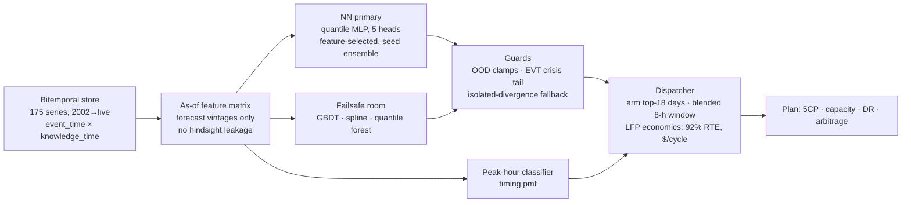

# Aurivest — a five-hour trading problem, solved like a desk

Ontario bills its largest industrial consumers on **five hours a year**: the five
provincial "coincident peak" hours set each factory's Global Adjustment charge —
routinely the largest line on the bill, $347,191/yr per MW of peak contribution
(2024 Class A rate).
Miss those hours and you overpay seven figures. Hit them and the bill collapses.

Aurivest puts a battery behind the factory's meter, **predicts those five hours,
and discharges through them** — then stacks capacity-auction, demand-response,
and arbitrage revenue on the same asset. This repo is the public engineering
showcase of the forecasting + dispatch engine. (The full system — the live data
pipeline, feature layer, and evaluation harness — is private; demo on request.)

## Results (walk-forward backtest, 16 complete seasons 2010–2025 + the live 2026 season)

| metric | result |
|---|---|
| CP hours **delivered ≥50% of nameplate**, through battery physics + settlement | **75/80 — 94%** (REAL-vintage leg 33/35, mean 9.4 MW of 10) |
| CP hours contained by the armed 8-h window | **79/80 — 99%** |
| **Live 2026 season to date** (base period incomplete) | **5/5 contained** |
| Modeled net value per 10 MW / 60 MWh site (backtest basis) | **~$3.4M/yr** |
| Forward, at capacity prices already cleared for 2026/27 | **~$5.0M/yr (~$500k/MW-yr)** |

*Corrected upward and downward in public as the engineering record moved
(recharge-physics fixes, an adopted intraday re-plan, a leak-clean rebuild);
the private repo carries every dated correction and the pre-registered gate
behind each number. Delivered-through-physics is the number a client buys —
window containment is the forecasting claim and always stated separately.*

| metric | result |
|---|---|
| Peak **days** alerted (18 alert days/season) | **85/85 — 100%** |
| Peak **hours** captured inside the 8-h discharge window | **83/85 — 98%** |
| Held-out test seasons (2022–2026), strict hour-in-window | **24/25** |
| Modeled gross value per 10 MW / 60 MWh site | **~$5.2M/yr** |
| Forecast-quality edge vs a naive forecast (GA alone) | **~$1M/yr/site** |

Every number is **selection-clean**: hyperparameters and design choices were
tuned only on pre-2022 seasons; 2022–2026 was evaluated once. Backtest and live
operation share one code path over a bitemporal store, so "as of 6 AM that
morning" is enforced by construction — the backtest physically cannot peek.

**Live**: the system runs as one pipeline on CI — hourly capture into the
append-only store, a weekly retrain, and a morning entrypoint
(`src/predict_today.py`) that produces the day's dispatch plan on the *same code
path* as the backtest. It emitted a real plan off the live store on 2026-07-24.
The public scored record began in July 2026 and is still young; it is a seed,
not evidence, and the scoreboard says so in its own header.

## Why this is hard (and interesting)

1. **~5 events per year.** Rare-event classification would overfit instantly.
   We instead regress the **continuous net-load curve** (every hour a training
   example, ~210k rows) and derive peak ranking and dispatch on top.
2. **The target fights back.** ~2 GW of coordinated peak-shaving (industrial
   curtailment, DR programs, storage) now deforms the very peaks everyone
   predicts — Goodhart's law on a power grid. The observed peak is a *fixed
   point of the market's forecasts*. We model net load *after* the collective
   response, with the growing "defense" as a first-class input.
3. **The duck curve moved the goalposts.** Behind-the-meter solar pushed the
   net-load peak into the evening; gross-demand models systematically misplace
   the hour. We model demand and embedded generation separately (satellite
   irradiance → clearness index → solar suppression).
4. **A crisis must widen you, not shrink you.** Averaging ensembles provably
   thin the upper tail (they delete the lone record-warning) — measured here as
   a 266 MW under-shoot on the top 0.5% of hours. The architecture below is the
   fix.

## Architecture

- **The NN leads** — it is the best single model (test pinball 89.6) and is made
  *un-failable without being held back*: input/output clamps stop garbage, a
  **crisis-conditional extreme-value tail** (GPD fit to historical exceedances,
  activated by the forecast heat regime) lets a genuine record go *higher* than
  the training range instead of clamping — peak-misses on crisis hours: 8% → 1%.
- **Failsafes are boundaries, not a committee vote.** The stable models only
  override the NN when it *alone* diverges with no crisis signal (robust MAD
  screen; fires on 0.01% of hours). We built the weighted mixture-master too,
  calibrated it, and **scrapped it when it lost to the best single model on
  held-out data** — the numbers decided, not the aesthetics.
- **The dispatcher speaks money, not RMSE**: missing a peak (~$750k) vs an
  extra cycle (~$1.1k) is a 700:1 asymmetry, so it operates on a high quantile,
  arms generously, and places the discharge window on a blend of timing
  probability and level mass — each choice selected on training seasons only.

## Engineering discipline (the part that doesn't demo well but matters most)

- **Bitemporal everything**: every record carries `event_time` and
  `knowledge_time`; every read is `as_of(decision_time)`. There is no separate
  live path to drift from the backtest.
- **Pre-registered gates**: the numeric pass/fail bar is committed *before* each
  evaluation runs. No metric shopping. Failed attempts stay in the history.
- **Adversarial self-audits**: a leakage harness tries to cheat our own backtest
  (it caught a 2× optimism bug in simulated weather noise — fixed with a
  correlated simulator calibrated on real forecast archives).
- **Fail loud**: validation rejects whole batches; a starved feature feed aborts
  the morning forecast rather than emitting a confidently wrong one.
- **Single-writer data**: the store is written only by CI; every clone is
  read-only. 506 synthetic-fixture tests, no network needed.

## What's in this repo

| file | what it shows |
|---|---|
| `src/quantile_nn.py` | the NN primary: joint quantile heads, pinball loss, seed ensemble, OOD guards |
| `src/guarded_primary.py` | crisis-EVT tail + the deployment predictor |
| `src/experts.py` | the failsafe room: spline, quantile forest, the (scrapped) gating master, the physics reference model |
| `src/dispatcher.py` | the battery dispatcher: arming, blended windows, LFP cycle economics |
| `src/predict_today.py` | the live morning entrypoint (runs against the private store) |
| `docs/how-it-works.md` | the full technical + business narrative |

## Honesty ledger

The backtest is a backtest; the live record began July 2026 and is young. The
two residual hour-misses (of 85) are days where every signal agrees on the
wrong hour — a real information ceiling at day-ahead, and the named next levers
(upper-air heat-dome features; LP-based intraday re-decision) are in the
roadmap, not in the results. Where a claim depends on a tariff rate, the rate
is verified against the primary source before it is quoted externally.

---

## What is deliberately not here

This repo is curated excerpts, published to be read rather than run: some modules
reference components that aren't included, and the **tuned operating points are
redacted** — the deployment recipe, the crisis-gate quantile, the guard's
divergence threshold. Those are the outputs of measured calibration studies, and
they are the only parts here that cost compute rather than thought.

They would also be worth little on their own. Every one was tuned against a
point-in-time store of Ontario net load that does not ship with this repo, and
the model is retrained against a live flow. That is the actual argument: a copied
artifact goes stale the day it is severed from the data feeding it. The
architecture is shown in full precisely because the architecture is not the moat.

Not included at all: the ingestion layer and source configs, the feature
assembly, the leakage harness, the walk-forward evaluation harness, the
hyperparameter search, and the data store itself.

Licence: source-available for evaluation, not open source. See `LICENSE`.

---

*Built end-to-end by a solo founder. Contact: sam@aurivestenergy.com*
